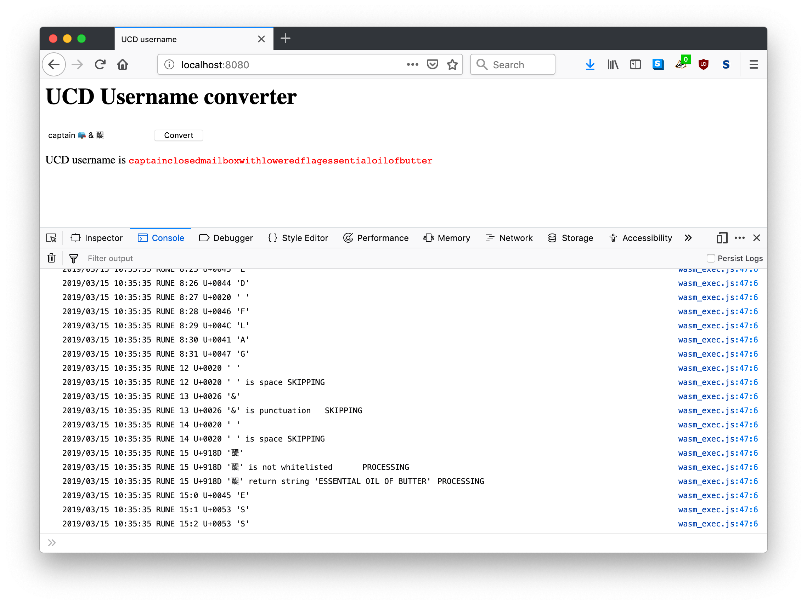

# go-ucd-username

Generates ASCII URL-safe aliases for Unicode usernames containing non-alphanumeric characters.

## What is this thing?

`go-ucd-username` generates ASCII URI-safe aliases for Unicode usernames containing non-alphanumeric (plus dashes) characters by converting them in to ASCII equivalents using the [go-ucd](https://github.com/cooperhewitt/go-ucd) package.

Specifically any character that is not `[a-zA-Z0-9\-]` is passed to [go-ucd](https://github.com/cooperhewitt/go-ucd) to determine its equivalent Unicode name string. By default those strings are simple descriptive ASCII English names, but some names in the [Unihan dataset](https://github.com/cooperhewitt/go-ucd/blob/master/unihan/unihan.go) contain non-ASCII characters so a final pass to filter out any character that is not `[a-zA-Z0-9\-]` is applied.

By default any whitespace or punctuation characters are ignored entirely but you can toggle these defaults if you choose (at which point they will be processed by [go-ucd](https://github.com/cooperhewitt/go-ucd)).

All strings are lower-cased.

### Example

Given the string `mr. 😁 / ../test 🚀 㐖` the following would happen:

```
2016/10/03 07:51:15 PARSE mr. 😁 / ../test 🚀 㐖
2016/10/03 07:51:15 RUNE 0 U+006D 'm'
2016/10/03 07:51:15 RUNE 1 U+0072 'r'
2016/10/03 07:51:15 RUNE 2 U+002E '.'
2016/10/03 07:51:15 RUNE 2 U+002E '.' is punctuation	SKIPPING
2016/10/03 07:51:15 RUNE 3 U+0020 ' '
2016/10/03 07:51:15 RUNE 3 U+0020 ' ' is space	SKIPPING
2016/10/03 07:51:15 RUNE 4 U+1F601 '😁'
2016/10/03 07:51:15 RUNE 4 U+1F601 '😁' is not whitelisted	PROCESSING
2016/10/03 07:51:15 RUNE 4 U+1F601 '😁' return string 'GRINNING FACE WITH SMILING EYES'	PROCESSING
2016/10/03 07:51:15 RUNE 4:0 U+0047 'G'
2016/10/03 07:51:15 RUNE 4:1 U+0052 'R'
2016/10/03 07:51:15 RUNE 4:2 U+0049 'I'
2016/10/03 07:51:15 RUNE 4:3 U+004E 'N'
2016/10/03 07:51:15 RUNE 4:4 U+004E 'N'
2016/10/03 07:51:15 RUNE 4:5 U+0049 'I'
2016/10/03 07:51:15 RUNE 4:6 U+004E 'N'
2016/10/03 07:51:15 RUNE 4:7 U+0047 'G'
2016/10/03 07:51:15 RUNE 4:8 U+0020 ' '
2016/10/03 07:51:15 RUNE 4:9 U+0046 'F'
2016/10/03 07:51:15 RUNE 4:10 U+0041 'A'
2016/10/03 07:51:15 RUNE 4:11 U+0043 'C'
2016/10/03 07:51:15 RUNE 4:12 U+0045 'E'
2016/10/03 07:51:15 RUNE 4:13 U+0020 ' '
2016/10/03 07:51:15 RUNE 4:14 U+0057 'W'
2016/10/03 07:51:15 RUNE 4:15 U+0049 'I'
2016/10/03 07:51:15 RUNE 4:16 U+0054 'T'
2016/10/03 07:51:15 RUNE 4:17 U+0048 'H'
2016/10/03 07:51:15 RUNE 4:18 U+0020 ' '
2016/10/03 07:51:15 RUNE 4:19 U+0053 'S'
2016/10/03 07:51:15 RUNE 4:20 U+004D 'M'
2016/10/03 07:51:15 RUNE 4:21 U+0049 'I'
2016/10/03 07:51:15 RUNE 4:22 U+004C 'L'
2016/10/03 07:51:15 RUNE 4:23 U+0049 'I'
2016/10/03 07:51:15 RUNE 4:24 U+004E 'N'
2016/10/03 07:51:15 RUNE 4:25 U+0047 'G'
2016/10/03 07:51:15 RUNE 4:26 U+0020 ' '
2016/10/03 07:51:15 RUNE 4:27 U+0045 'E'
2016/10/03 07:51:15 RUNE 4:28 U+0059 'Y'
2016/10/03 07:51:15 RUNE 4:29 U+0045 'E'
2016/10/03 07:51:15 RUNE 4:30 U+0053 'S'
2016/10/03 07:51:15 RUNE 8 U+0020 ' '
2016/10/03 07:51:15 RUNE 8 U+0020 ' ' is space	SKIPPING
2016/10/03 07:51:15 RUNE 9 U+002F '/'
2016/10/03 07:51:15 RUNE 9 U+002F '/' is punctuation	SKIPPING
2016/10/03 07:51:15 RUNE 10 U+0020 ' '
2016/10/03 07:51:15 RUNE 10 U+0020 ' ' is space	SKIPPING
2016/10/03 07:51:15 RUNE 11 U+002E '.'
2016/10/03 07:51:15 RUNE 11 U+002E '.' is punctuation	SKIPPING
2016/10/03 07:51:15 RUNE 12 U+002E '.'
2016/10/03 07:51:15 RUNE 12 U+002E '.' is punctuation	SKIPPING
2016/10/03 07:51:15 RUNE 13 U+002F '/'
2016/10/03 07:51:15 RUNE 13 U+002F '/' is punctuation	SKIPPING
2016/10/03 07:51:15 RUNE 14 U+0074 't'
2016/10/03 07:51:15 RUNE 15 U+0065 'e'
2016/10/03 07:51:15 RUNE 16 U+0073 's'
2016/10/03 07:51:15 RUNE 17 U+0074 't'
2016/10/03 07:51:15 RUNE 18 U+0020 ' '
2016/10/03 07:51:15 RUNE 18 U+0020 ' ' is space	SKIPPING
2016/10/03 07:51:15 RUNE 19 U+1F680 '🚀'
2016/10/03 07:51:15 RUNE 19 U+1F680 '🚀' is not whitelisted	PROCESSING
2016/10/03 07:51:15 RUNE 19 U+1F680 '🚀' return string 'ROCKET'	PROCESSING
2016/10/03 07:51:15 RUNE 19:0 U+0052 'R'
2016/10/03 07:51:15 RUNE 19:1 U+004F 'O'
2016/10/03 07:51:15 RUNE 19:2 U+0043 'C'
2016/10/03 07:51:15 RUNE 19:3 U+004B 'K'
2016/10/03 07:51:15 RUNE 19:4 U+0045 'E'
2016/10/03 07:51:15 RUNE 19:5 U+0054 'T'
2016/10/03 07:51:15 RUNE 23 U+0020 ' '
2016/10/03 07:51:15 RUNE 23 U+0020 ' ' is space	SKIPPING
2016/10/03 07:51:15 RUNE 24 U+3416 '㐖'
2016/10/03 07:51:15 RUNE 24 U+3416 '㐖' is not whitelisted	PROCESSING
2016/10/03 07:51:15 RUNE 24 U+3416 '㐖' return string '㐖毒, AN OLD NAME FOR INDIA'	PROCESSING
2016/10/03 07:51:15 RUNE 24:0 U+3416 '㐖'
2016/10/03 07:51:15 RUNE 24:3 U+6BD2 '毒'
2016/10/03 07:51:15 RUNE 24:6 U+002C ','
2016/10/03 07:51:15 RUNE 24:7 U+0020 ' '
2016/10/03 07:51:15 RUNE 24:8 U+0041 'A'
2016/10/03 07:51:15 RUNE 24:9 U+004E 'N'
2016/10/03 07:51:15 RUNE 24:10 U+0020 ' '
2016/10/03 07:51:15 RUNE 24:11 U+004F 'O'
2016/10/03 07:51:15 RUNE 24:12 U+004C 'L'
2016/10/03 07:51:15 RUNE 24:13 U+0044 'D'
2016/10/03 07:51:15 RUNE 24:14 U+0020 ' '
2016/10/03 07:51:15 RUNE 24:15 U+004E 'N'
2016/10/03 07:51:15 RUNE 24:16 U+0041 'A'
2016/10/03 07:51:15 RUNE 24:17 U+004D 'M'
2016/10/03 07:51:15 RUNE 24:18 U+0045 'E'
2016/10/03 07:51:15 RUNE 24:19 U+0020 ' '
2016/10/03 07:51:15 RUNE 24:20 U+0046 'F'
2016/10/03 07:51:15 RUNE 24:21 U+004F 'O'
2016/10/03 07:51:15 RUNE 24:22 U+0052 'R'
2016/10/03 07:51:15 RUNE 24:23 U+0020 ' '
2016/10/03 07:51:15 RUNE 24:24 U+0049 'I'
2016/10/03 07:51:15 RUNE 24:25 U+004E 'N'
2016/10/03 07:51:15 RUNE 24:26 U+0044 'D'
2016/10/03 07:51:15 RUNE 24:27 U+0049 'I'
2016/10/03 07:51:15 RUNE 24:28 U+0041 'A'
```

Resulting in the string `mrgrinningfacewithsmilingeyestestrocketanoldnameforindia`. What you do (or don't do) with that string afterwards is entirely up to you!

## But... why?

Principally so that you can provide meaningful "pretty" URL-safe aliases for users with full Unicode usernames.

For example, a user with the name `Admiral🍦` would have the URL alias `/admiralsofticecream`. _If you don't already have users with names like that... you will._

While it's true that an [Internalized Resource Identifier](https://en.wikipedia.org/wiki/Internationalized_Resource_Identifier) (IRI) would allow you to create an equivalent `/Admiral%20🍦` URL it's still early days for IRIs meaning browser support is uneven and there are a number of [security concerns](http://unicode.org/reports/tr36/) that haven't been fully sorted yet.

`go-ucd-username` side-steps all those issues and allows for a better-than-nothing alternative.

## Install

So long as you already have [Go](http://www.golang.org) (and `make`) installed you should be able to simply type:

```
make tools
```

All of the dependencies are included in the [vendor](vendor) directory. If you don't have `make` installed you can get started by executing the relevant commands in the [Makefile](Makefile).

## Usage

```
package main

import (
	"flag"
	"fmt"
	"github.com/aaronland/go-ucd-username"
	"log"
	"os"
	"strings"
)

func main() {

	var spaces = flag.Bool("spaces", false, "Do not filter out whitespace during processing")
	var punct = flag.Bool("punct", false, "Do not filter out punctuation during processing")
	var debug = flag.Bool("debug", false, "Enable verbose logging during processing")

	flag.Parse()
	args := flag.Args()

	pretty := strings.Join(args, " ")

	uname, err := username.NewUCDUsername()

	if err != nil {
		log.Fatal(err)
	}

	uname.Debug = *debug
	uname.AllowSpaces = *spaces
	uname.AllowPunctuation = *punct

	safe, err := uname.Translate(pretty)

	if err != nil {
		log.Fatal(err)
	}

	fmt.Println(safe)
	os.Exit(0)
}
```

## Tools

### ucd-username

```
Usage of ./bin/ucd-username:
  -debug
	Enable verbose logging during processing
  -punct
	Do not filter out punctuation during processing
  -spaces
	Do not filter out whitespace during processing
```

For example:

```
./bin/ucd-username mr. 😁
mrgrinningfacewithsmilingeyes
```

### ucd-usernamed

```
./bin/ucd-usernamed -h
Usage of ./bin/ucd-usernamed:
  -debug
    	Enable verbose logging during processing
  -host string
    	What host to bind ucd-usernamed to (default "localhost")
  -port int
    	What port to bind ucd-usernamed to (default 8080)
  -punct
    	Do not filter out punctuation during processing
  -spaces
    	Do not filter out whitespace during processing
```

For example:

```
./bin/ucd-usernamed -port 8081
2017/04/07 18:02:51 listening on localhost:8081
```

And then:

```
# as in: http://localhost:8081?username=mr. 😁

$> curl -s -i 'http://localhost:8081?username=mr.+%F0%9F%98%81'
HTTP/1.1 200 OK
Content-Length: 29
Content-Type: text/plain
Date: Sat, 08 Apr 2017 01:02:58 GMT

mrgrinningfacewithsmilingeyes
```
## Docker

[Yes](Dockerfile).

```
docker build -t ucd-username .
docker run -p 6161:8080 -e HOST='0.0.0.0' ucd-username

curl 'localhost:6161?username=\U+01F937'
shrug
```

## WASM

Yes. See the [ucd-wasm.go](cmd/ucd-wasm.go) tool for details. It depends on Go `1.12` or higher to build. Remember: All the [WASM stuff](https://golang.org/pkg/syscall/js/) in Go is still considered experimental.

As of this writing space and punctuation are explicitly disallowed when converting usernames. That could/should be modified to check input variables (in JavaScript-land) but today it does not.



There is a pre-built sample application in the [www](/www) directory. You can also try a live version here:

https://aaronland.github.io/go-ucd-username/

## See also

* https://github.com/aaronland/go-ucd
* https://github.com/whosonfirst/go-sanitize
* https://emojipedia.org/shrug/
